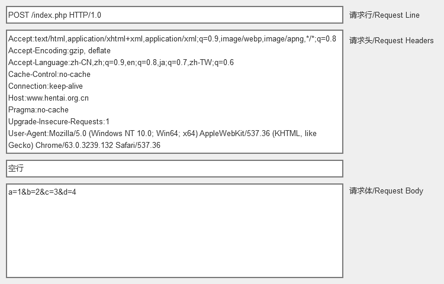

## 介绍
- [安装nginx](./01%20introduction/01-installing-nginx.md)
- [新手手册](./01%20introduction/02-beginners-guide.md)
- ~~高手手册~~
- [nginx管理](./01%20introduction/03-controlling-nginx.md)
- [连接处理模式](./01%20introduction/04-connection-processing-methods.md)
- hash设置
- 调试日志
- 单位设置
- 命令行参数
- windows版的nginx
- nginx如何处理请求
- 服务名称server_name
- 使用nginx作HTTP负载均衡
- 配置HTTPS服务器
- nginx如何处理TCP/UDP会话
- [关于nginScript](./01%20introduction/15-about-nginscript.md)

## HTTP请求结构及命名
因为在翻译中，可能我使用的翻译名称不当，为免引发歧义，现将HTTP请求头的命名以图例表示出来：

## HOW-TO
- [源码编绎安装Nginx](./02%20how-to/01-building-nginx-from-sources.md)
- 在win32平台上使用Visual C编绎安装nginx
- 在Amazon EC2平台上配置NGINX Plus环境
- 使用DTrace pid provider调试nginx

## 开发
- 如何贡献代码
- 开发向导

## 模块参考
- 指令表
- 变量表

- 核心指令

- [ngx_http_core_module](./04%20modules/04-ngx-http-core-module.md)
- ngx_http_access_module
- ngx_http_addition_module
- ngx_http_api_module
- ngx_http_auth_basic_module
- ngx_http_auth_jwt_module
- ngx_http_auth_request_module
- ngx_http_autoindex_module
- ngx_http_browser_module
- ngx_http_charset_module
- ngx_http_dav_module
- ngx_http_empty_gif_module
- ngx_http_f4f_module
- ngx_http_fastcgi_module
- ngx_http_flv_module
- ngx_http_geo_module
- ngx_http_geoip_module
- ngx_http_gunzip_module
- ngx_http_gzip_module
- ngx_http_gzip_static_module
- ngx_http_headers_module
- ngx_http_hls_module
- ngx_http_image_filter_module
- ngx_http_index_module
- ngx_http_js_module
- ngx_http_keyval_module
- ngx_http_limit_conn_module
- ngx_http_limit_req_module
- ngx_http_log_module
- ngx_http_map_module
- ngx_http_memcached_module
- ngx_http_mirror_module
- ngx_http_mp4_module
- ngx_http_perl_module
- ngx_http_proxy_module
- ngx_http_random_index_module
- ngx_http_realip_module
- ngx_http_referer_module
- ngx_http_rewrite_module
- ngx_http_scgi_module
- ngx_http_secure_link_module
- ngx_http_session_log_module
- ngx_http_slice_module
- ngx_http_spdy_module
- ngx_http_split_clients_module
- ngx_http_ssi_module
- ngx_http_ssl_module
- ngx_http_status_module
- ngx_http_stub_status_module
- ngx_http_sub_module
- ngx_http_upstream_module
- ngx_http_upstream_conf_module
- ngx_http_upstream_hc_module
- ngx_http_userid_module
- ngx_http_uwsgi_module
- ngx_http_v2_module
- ngx_http_xslt_module
- ngx_mail_core_module
- ngx_mail_auth_http_module
- ngx_mail_proxy_module
- ngx_mail_ssl_module
- ngx_mail_imap_module
- ngx_mail_pop3_module
- ngx_mail_smtp_module
- ngx_stream_core_module
- ngx_stream_access_module
- ngx_stream_geo_module
- ngx_stream_geoip_module
- ngx_stream_js_module
- ngx_stream_limit_conn_module
- ngx_stream_log_module
- ngx_stream_map_module
- ngx_stream_proxy_module
- ngx_stream_realip_module
- ngx_stream_return_module
- ngx_stream_split_clients_module
- ngx_stream_ssl_module
- ngx_stream_ssl_preread_module
- ngx_stream_upstream_module
- ngx_stream_upstream_hc_module
- ngx_google_perftools_module